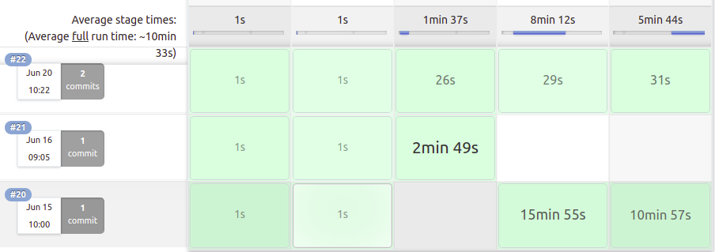

# DevOps Tip 3

Containers in reality are a set of layers, each step you define in the dockerfile is a layer, when you build the image docker checks if it exists in cache, if so it will avoid building the layer again.

To decide if the layer should be updated or not, docker checks if the step is changed, let's say you updating your code and add it to the container so in this case docker will build the step, if the code is not updated, the cache will be used.

When writing your dockerfiles try making steps atomic, if you have a requirements file in a python app, try to add it and install packages in different step than adding your application code to avoid installing the packages each time you change your code.

See the screenshot below how much time gained:

